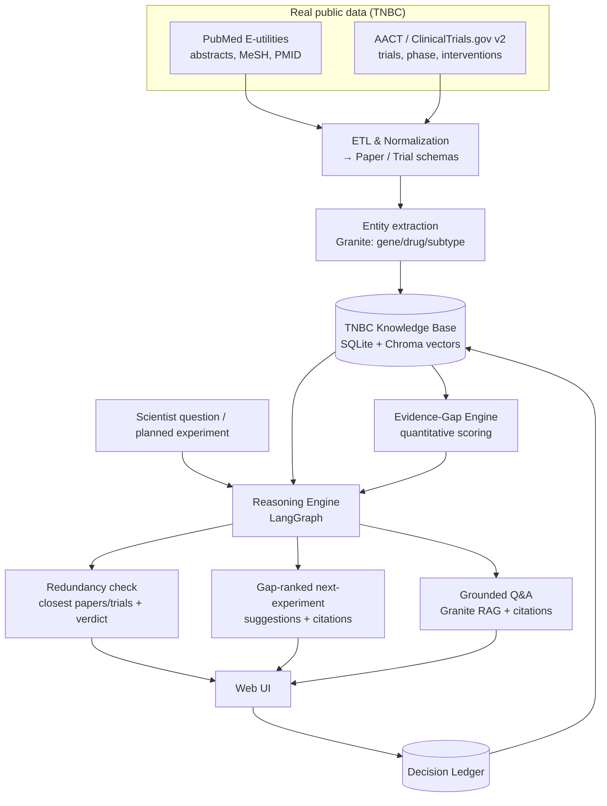

# BenchPilot — Project Map
### *An evidence-grounded AI co-worker for a cancer-biology lab*
**Bench-to-Decision** · IBM AI Builders Challenge — Wildcard Track ("Build Intelligent Systems for the Future of Work")
**Domain focus: Triple-Negative Breast Cancer (TNBC)**

> Working name: **BenchPilot**. Built with **IBM Bob** (primary dev tool) · **AI as the core component** · public repo + ≤3-min demo.
> Data is **real**, not synthetic: a custom knowledge base built from **PubMed** (mechanistic literature) + **AACT / ClinicalTrials.gov** (clinical trials), scoped to **TNBC**.

---

## 0. One-paragraph pitch

Every "AI co-worker" targets the office inbox. **None target the science bench.** A TNBC research lab drowns in evidence — thousands of PubMed papers and hundreds of clinical trials — yet the highest-value decision, *"what should we study next, and hasn't it already been done?"*, stays slow and tacit. **BenchPilot** builds a living knowledge base from **PubMed + ClinicalTrials.gov around TNBC**, then acts as a co-worker that (1) answers questions grounded in real papers and trials with citations, (2) flags when a planned experiment is **redundant** with the literature, and (3) surfaces **high-value evidence gaps** — directions with clinical momentum but thin mechanistic support (or vice-versa) — as ranked, cited next-experiment suggestions. The reasoning layer runs on **IBM Granite (watsonx)**; a quantitative **evidence-gap score** over the real corpus makes recommendations *defensible, not guessed*.

**Why it wins the judging criteria**
| Criterion | How BenchPilot scores |
|---|---|
| Technical Execution | Real ETL (PubMed + AACT) + Granite extraction/RAG + a quantitative gap-scoring engine + agent graph, all on IBM stack |
| Innovation | AI co-worker for the *bench* + an **evidence-gap detector** for a real disease — an unclaimed combination |
| Challenge Fit | Decision support + knowledge orchestration = textbook "Future of Work" |
| Feasibility | Bounded TNBC corpus (public APIs) → demoable in 4 weeks; runs with a mock-LLM fallback |
| Real-World Impact | Founder is a molecular biologist; targets a real, expensive R&D bottleneck with real data |

---

## 1. Target user & demo scenario

- **User:** a scientist / PI in a **TNBC lab** planning the next study.
- **The loop BenchPilot closes:**
  1. Scientist enters a question or a **planned experiment** ("test ATR inhibitor + PARP inhibitor in BRCA-wildtype TNBC").
  2. BenchPilot retrieves relevant **papers + trials** from the TNBC DB (RAG).
  3. Synthesizes **state of evidence** with citations (what's known, contested, in-clinic).
  4. **Redundancy check** — "closely matches PMID … / NCT …; here's how to differentiate."
  5. **Gap-ranked next directions** — cited, scored suggestions of under-explored but promising ideas.
  6. Scientist accepts / edits / rejects → **Decision Ledger** → feeds memory.
- **Why TNBC:** dense in both mechanism (BRCA/HR-deficiency, PARP, ATR, cell-cycle, PI3K/AKT) and clinic (pembrolizumab, sacituzumab govitecan/TROP2 ADCs, PARP inhibitors) → the mechanistic-vs-clinical gap is real and demoable.

---

## 2. Scope — MVP vs. stretch

### MVP (the graded prototype)
- **Data build:** ETL scripts that pull TNBC **PubMed abstracts** + **AACT trials** into a local DB (reproducible, committed as a small snapshot).
- **Entity extraction** (genes/targets, drugs, TNBC subtypes) from abstracts/trials via Granite → structured.
- **Lab Memory / RAG:** embed papers + trials; grounded Q&A with citations.
- **Redundancy check:** given a planned experiment, find the closest existing papers/trials + a "novelty verdict."
- **Evidence-gap score + ranked next-experiment suggestions** (the quantitative core).
- **Decision Ledger** (accept/modify/reject + reason).
- **Web UI:** ask box · evidence panel (papers + trials, cited) · redundancy verdict · ranked gap suggestions · ledger.

### Stretch
- **Co-occurrence knowledge graph** (gene–drug–TNBC) + missing-link suggestions.
- Trend view (trial phases over time; literature volume by target).
- watsonx.governance logging of each recommendation (trust story).
- "Decision brief" PDF export for lab meeting.

### Out of scope
- Real LIMS/ELN integration, auth/multi-tenant, live instrument data, full-text PDF ingestion (abstracts + trial records only).

---

## 3. System architecture



**Component summary**
| Module | Job | Core tech |
|---|---|---|
| ETL & Normalization | Pull + clean PubMed + AACT into Paper/Trial records | Python, requests, pandas |
| Entity extraction | Genes/drugs/subtypes from text → structured | **Granite** (JSON output) |
| TNBC Knowledge Base | Store records + embeddings | SQLite + Chroma (Granite embeddings) |
| Evidence-Gap Engine | Score candidate directions from real signals | Python (deterministic scoring) |
| Reasoning Engine | Orchestrate retrieve → synthesize → check → rank | **LangGraph** + **watsonx/Granite** |
| Redundancy check | Nearest-neighbor vs corpus + novelty verdict | vector search + Granite verdict |
| Decision Ledger | Log human decisions + reasons | append-only table |
| Web UI | Ask · evidence · verdict · suggestions · ledger | Streamlit (fast) or Next.js |

---

## 4. Data model (core schemas)

```jsonc
// Paper (from PubMed)
{ "pmid": "38xxxxxx", "title": "...", "abstract": "...",
  "journal": "...", "year": 2024, "mesh": ["Triple Negative Breast Neoplasms", "..."],
  "entities": { "genes": ["BRCA1","ATR"], "drugs": ["olaparib"], "subtypes": ["BL1"] },
  "embedding_id": "..." }

// Trial (from AACT / ClinicalTrials.gov)
{ "nct_id": "NCT0xxxxxxx", "brief_title": "...", "phase": "Phase 2",
  "status": "Recruiting", "conditions": ["Triple Negative Breast Cancer"],
  "interventions": [{"type":"Drug","name":"Sacituzumab govitecan"}],
  "primary_outcomes": ["PFS"], "sponsor": "...", "start_date": "2023-05",
  "enrollment": 120, "entities": { "genes": ["TROP2"], "drugs": ["sacituzumab govitecan"] } }

// GapCandidate (scored)
{ "candidate": "ATR inhibitor + PARP inhibitor in BRCA-wildtype TNBC",
  "lit_count": 12, "lit_recency_yr": 2024, "trial_count": 3, "max_phase": "Phase 2",
  "mech_vs_clin": "clinical-ahead",     // clinical momentum > mechanistic depth
  "gap_score": 0.78, "rationale": "...", "citations": {"pmids":[...], "ncts":[...]} }

// DecisionLedgerEntry
{ "suggestion_id": "...", "human_action": "accept|modify|reject",
  "final_direction": "...", "reason": "...", "decided_by": "FL", "timestamp": "..." }
```

---

## 5. Tech stack

| Layer | Choice | Notes |
|---|---|---|
| Language | **Python 3.11** (+ TS if Next.js UI) | Bob handles both |
| Data sources | **PubMed E-utilities**, **ClinicalTrials.gov API v2 / AACT** | public, no proprietary code |
| LLM inference | **watsonx.ai** hosting **IBM Granite** | extraction, synthesis, verdicts, Q&A |
| Embeddings | **Granite embeddings** (watsonx) | Lab Memory RAG |
| Orchestration | **LangGraph** (LangChain) | the decision-loop graph |
| Optional visual | **LangFlow** | prototype pipeline; screenshot for demo |
| Vector store | Chroma (start) / **Milvus** (mention) | |
| Gap engine | pure Python scoring (+ optional networkx graph) | deterministic, defensible |
| UI | **Streamlit** (fast path) or Next.js | Streamlit saves time + coins |
| Storage | SQLite (`benchpilot.db`) | zero-config; commit a small snapshot |

> **Reproducibility:** commit a **bounded snapshot** of the corpus (e.g., a few hundred–~1.5k papers + all TNBC trials) so anyone can clone and run the demo without re-pulling. `MOCK_LLM=true` returns canned JSON so the UI never blocks on watsonx.

---

## 6. Where & how to use IBM technology ("Best Use of Technology")

| IBM tech | Where in BenchPilot | Why |
|---|---|---|
| **watsonx.ai** | All LLM calls (extraction, synthesis, redundancy verdict, gap rationale, Q&A) | Required-recommended platform; one API for Granite |
| **IBM Granite (instruct)** | Entity extraction from abstracts/trials; evidence synthesis; novelty verdict; suggestion rationale | Strong structured/JSON output; governable |
| **Granite embeddings** | Vectorize papers + trials for RAG and redundancy search | Keeps stack on IBM |
| **LangChain / LangGraph** | Stateful decision graph: retrieve → synthesize → check → rank → log | Maps 1:1 to the loop |
| **LangFlow** *(optional)* | Visual pipeline build; compelling demo screenshot | Fast prototyping |
| **watsonx.governance** *(stretch)* | Log/monitor recommendations → trust & traceability for science | Elevates the "defensible decision support" story |

**Granite design notes (put in SPEC):** force schema-constrained **JSON**; temperature ~0.2; give Granite *retrieved evidence + the gap engine's scored candidate* and ask it to **justify or challenge** it (LLM as scientific critic, gap engine as the quantitative driver) — this hybrid is the innovation.

---

## 7. Reuse from TrialSense — **patterns only, no proprietary code**

Reuse transferable *ideas*, write all-new public code:
- AACT/CTG **ingestion → normalization → schema** pattern.
- PubMed **fetch + parse** pattern (E-utilities).
- Modular **ingest / reason / serve** service layout.
- Literature-linking conventions.

TrialSense source stays private; BenchPilot ships clean code, public APIs, committed snapshot.

---

## 8. Four-week build plan (spec-driven, Bob-first)

| Week | Goal | Deliverables | Done when |
|---|---|---|---|
| **0 (1–2 days)** | Foundations | SkillsBuild done; Bob installed✔; public repo + README skeleton; **SPEC.md written**; GitHub MCP wired | Repo public, SPEC committed |
| **1** | **Real data build** | ETL: PubMed + AACT → SQLite; entity extraction; embeddings; committed snapshot | Can query TNBC papers + trials locally |
| **2** | Reasoning core | LangGraph graph; Granite synthesis + grounded Q&A with citations | Ask a TNBC question → cited answer |
| **3** | Gap engine + redundancy + ledger | Evidence-gap scoring; redundancy verdict; ledger | "Ranked gap suggestions" + "novelty verdict" work |
| **4** | UI + polish + submit | Streamlit UI; **grill-me** review; 3-min video; README | Public repo + video submitted before deadline |

---

## 9. 💰 IBM Bob 40-credit (Bobcoin) budget

**Principle:** spend coins on high-leverage generative work (planning, complex features, review); do cheap/mechanical work by hand. Make the **architecture + core features visibly come from Bob**, and commit `.bob/`, `SPEC.md`, `implementation-plan.md` as proof.

| Phase | Bob task (spend) | Est. | Do yourself / free (save) |
|---|---|---|---|
| Setup | 1 Ask-mode repo/scaffold pass | **2** | Write SPEC by hand; get API keys |
| Wk1 | Plan-mode → generate ETL (PubMed+AACT) + schemas + entity-extraction | **8** | Run the pulls, eyeball data, fix small parse bugs |
| Wk2 | **Core:** LangGraph + Granite RAG/synthesis with citations (hardest) | **12** | .env, sample queries, manual test |
| Wk3 | Gap-scoring engine + redundancy verdict + ledger | **8** | Tune weights/thresholds by hand |
| Wk4 | Streamlit UI generation + wiring | **5** | Styling, copy, screenshots, video |
| Wk4 | 1 **grill-me** review before submit | **3** | Record video, write README |
| — | **Reserve buffer** | **2** | one rework |

**Conservation rules:** (1) SPEC-first so Bob never guesses. (2) One Plan-mode call per phase, batched. (3) Full context in one shot (paste SPEC section + paths). (4) No coins on renames/config/CSS/tests — do by hand. (5) Manual testing; call Bob back only with a precise repro. (6) Protect coins for the Week-2 reasoning core. (7) `grill-me` once, late. (8) Watch `/settings` usage.

---

## 10. Repo structure (public, judge-optimized)

```
benchpilot/
├── README.md                 # problem · solution · AI architecture · theme · HOW BOB WAS USED
├── SPEC.md                   # spec-driven-dev spec (Bob consumes this)
├── .bob/                     # COMMIT — proof of Bob usage (skills, mcp.json, plan)
├── implementation-plan.md    # Bob Plan-mode output — COMMIT
├── etl/
│   ├── fetch_pubmed.py       # PubMed E-utilities → papers
│   ├── fetch_trials.py       # ClinicalTrials.gov v2 → trials
│   └── build_db.py           # normalize + entity-extract + embed → SQLite/Chroma
├── data/
│   └── snapshot/             # committed bounded TNBC corpus (reproducible demo)
├── src/
│   ├── llm/                  # watsonx/Granite client (+ MOCK_LLM)
│   ├── memory/               # vector + structured store, RAG
│   ├── reasoning/            # LangGraph graph
│   ├── gap/                  # evidence-gap scoring (+ optional graph)
│   ├── ledger/               # decision ledger
│   └── app/                  # Streamlit UI
├── docs/architecture.md
├── .env.example
└── requirements.txt
```

**README must include (scored):** Problem · Solution · AI approach & architecture · Selected theme (Wildcard – Future of Work) · **How IBM Bob was used** (+ `.bob` screenshots).

---

## 11. 3-minute demo/video script

1. **0:00–0:25 — Problem.** "A TNBC lab faces thousands of papers and hundreds of trials. Deciding what to study next is slow and tacit."
2. **0:25–0:55 — The DB.** Show the real TNBC knowledge base (paper + trial counts, entities).
3. **0:55–1:35 — Grounded answer.** Ask "state of PARP + immunotherapy in BRCA-wildtype TNBC?" → cited synthesis (real PMIDs + NCTs).
4. **1:35–2:15 — Redundancy + gap (the wow).** Enter a planned experiment → "similar to NCT… — differentiate" + **ranked gap suggestions** with scores + citations.
5. **2:15–2:40 — Close the loop.** Accept a suggestion → Decision Ledger logs it with rationale.
6. **2:40–3:00 — Built with IBM.** watsonx + Granite + LangGraph; **built with IBM Bob** (flash `.bob`/plan). Impact line.

---

## 12. Risks & guards

| Risk | Guard |
|---|---|
| Corpus too big / API rate limits | Bound the pull (recent years, capped N); cache; commit a snapshot |
| watsonx setup friction | Do keys in Week 0; `MOCK_LLM` fallback so UI never blocks |
| "Just an LLM" perception | Real gap-scoring engine over real data = quantitative + defensible |
| Entity extraction noise | Constrain Granite to a controlled vocab (curated TNBC gene/drug lists) |
| Burning coins early | SPEC-first + §9 rules |
| PubMed/CTG ToS | Use official APIs, respect rate limits, store only metadata/abstracts |

---

## 13. Immediate next actions
- [x] Choose domain → **TNBC**
- [ ] I build a **starter TNBC corpus** (PubMed + ClinicalTrials.gov) into `data/snapshot/`
- [ ] Complete IBM SkillsBuild activity
- [ ] Get **watsonx.ai** API key + Granite model id → `.env`
- [ ] Finalize **SPEC.md**, create public repo, Week-0 Bob Ask/Plan pass

---
*Prepared for Fedor · BenchPilot / Bench-to-Decision · TNBC edition · IBM AI Builders Challenge (Wildcard).*
