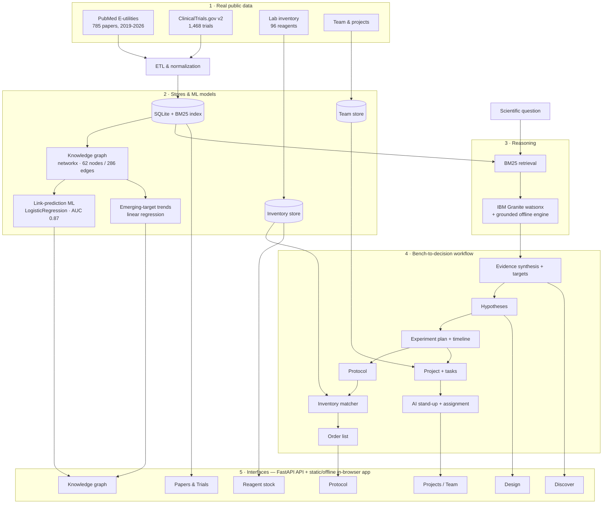

**An evidence-grounded AI co-worker for the cancer-biology lab — it takes a research idea from question to a staffed, scheduled experimental plan in about an hour instead of weeks.**

*Built with IBM Bob · IBM AI Builders Challenge — Wildcard Track: Build Intelligent Systems for the Future of Work*

- **🌐 Live app:** https://lipskerov.github.io/benchpilot/ *(runs fully in the browser — no server, no API keys)*
- **🎥 Demo video (≤3 min):** https://youtu.be/EWKyWWj4YKQ
- **📦 Repository:** https://github.com/Lipskerov/benchpilot

---

## Why I built this

I'm a molecular biologist. I know the TNBC (triple-negative breast cancer) field, and I know exactly how a project starts in a real lab — because I do it, and I watch my colleagues do it.

Here's the uncomfortable truth: **from having a research idea to actually starting the first experiment at the bench, it takes us about three weeks.** Not because the science is hard yet — but because of everything *around* the science:

- ~3–5 days screening the literature and trials to work out what's worth doing (and what's already been done),
- ~2–3 days turning that into a defensible hypothesis and experimental design,
- ~2–3 days writing protocols with the right cell lines, controls, and reagents,
- ~1–2 days cross-checking reagent stock and building an order list,
- ~1–2 days planning the work and assigning it across the team.

That's ~2–3 weeks of scattered desk-work before a single pipette moves. It's slow, it's repetitive, it's easy to duplicate effort, and the knowledge lives in people's heads. **Every "AI co-worker" I could find helps with the office inbox — none of them help at the bench.**

So I built the tool I actually needed for my own work and for our lab's performance. BenchPilot compresses that entire desk-work phase from **~3 weeks into ~1 hour**, grounded in real evidence rather than a chatbot's guess.

---

## How I used it — a real example (immunotherapy in TNBC)

I opened BenchPilot and typed one plain question:
> *"How can immunotherapy improve treatment response in triple-negative breast cancer?"*

**1. Literature, in seconds instead of days.** It searched all **785 papers + 1,468 trials** and gave me a grounded synthesis with citations, then ranked the real molecular targets by evidence. **PD-L1 came out on top (15 papers, 13 trials).** Doing that triage by hand — skimming ~2,250 documents to map the immunotherapy landscape — normally costs me the better part of a week.

**2. A hypothesis I could defend.** It proposed three competing, testable hypotheses in plain language. I picked the strongest: *adding a PD-L1 checkpoint blocker to chemotherapy improves response*, with a quantitative prediction and a clear falsification condition.

**3. A full experiment plan with a timeline.** In one click it laid out a **5-work-package plan across 9 weeks** — Western blot for PD-L1 expression, IF microscopy, a dose-response assay, a chemo + immunotherapy combination, and analysis — each with the right cell lines (MDA-MB-231/468, MCF-10A control), treatment groups, replicates, and reagents. Two experiments run in parallel, the rest in sequence.

***This is me doing it:***


**4. Reagents reconciled instantly.** It drafted the protocol and checked it against my lab's live inventory, **flagged that olaparib was out of stock**, and produced an order list. That cross-check is usually an afternoon of tab-switching.

**5. The whole thing became a staffed project.** One click created the project, auto-assigned my team by expertise and workload, and put it on a live board with an AI stand-up that reads status + reagent-readiness.

**6. And it gave me an idea I didn't have.** The knowledge graph's link-prediction model flagged **sacituzumab × PARP1** and **durvalumab × sacituzumab** as *under-studied but structurally-supported* combinations worth exploring (model AUC 0.87). I hadn't prioritized either — that's the kind of connection I'd normally only stumble on months later.

**Net result:** what usually takes me ~2–3 weeks of setup took **about an hour**, end to end.

---

## Impact & metrics

Measured system metrics (real, reproducible):

| Metric | Value |
|---|---|
| Evidence base indexed | **2,253 documents** — 785 PubMed papers (2019–2026) + 1,468 ClinicalTrials.gov trials |
| Retrieval | **BM25**, sub-second, fully offline / in-browser |
| Knowledge graph | **62 entities · 286 co-mention edges · 5 communities** (genes/targets, drugs, subtypes) |
| Link-prediction model | **scikit-learn LogisticRegression, test AUC ≈ 0.87** (5 graph-topology features) |
| Trend detection | linear regression over yearly mentions (emerging-target flagging) |
| Reagent inventory | 96 items, protocol → live-stock reconciliation → order list |
| Deployment | ~2 MB static app, loads in the browser, no backend, no keys |

Time impact (estimated from my own lab workflow — not a controlled study):

| Task | Manual | With BenchPilot |
|---|---|---|
| Literature/trial triage → candidate targets | ~3–5 days | **seconds** |
| Idea → staffed, scheduled experimental plan (lit + hypothesis + design + protocol + reagents + assignment) | **~2–3 weeks** | **~1 hour** |
| Reagent reconciliation + order list | ~1–2 hours | **seconds** |

---

## What it does (the solution)

BenchPilot closes the full **bench-to-decision** loop and coordinates the team around it:

1. **Ask a question** → grounded search over 785 papers + 1,468 trials, with cited synthesis and ranked targets.
2. **Generate hypotheses** → plain-language, testable, with predictions and falsification criteria.
3. **Get an experiment plan + timeline** → work packages (parallel + sequential), cell lines, test groups, reagents.
4. **Draft a protocol + check inventory** → flags exactly what to order.
5. **Spin up a staffed project** → auto-assign the team, drag-and-drop board, per-project roadmap.
6. **AI stand-up** → reads status, reagent-readiness, and workload to say what to do next and who should do it.
7. **Knowledge graph + ML** → co-mention network with a link-prediction model recommending under-studied connections.
8. **Browse the full evidence base** → searchable Papers & Trials library.

Reasoning runs on **IBM Granite (watsonx)** when configured, with a grounded **offline engine** (BM25 + templated reasoning) so it works with zero keys.

## AI Approach & Architecture



| Module | Technology | Purpose |
|---|---|---|
| Data ingestion | PubMed E-utilities · ClinicalTrials.gov API v2 | Real TNBC papers + trials |
| Knowledge base | SQLite + **BM25** | Precise, explainable retrieval |
| Reasoning | **IBM Granite (watsonx)** + offline fallback | Synthesis, hypotheses, plans, protocols |
| Knowledge graph | networkx + **scikit-learn** | Co-mention network + link-prediction ML |
| Inventory / Team | SQLite + AI digest | Order list · board · stand-up · assignment |
| Backend | **FastAPI** (interactive docs at `/docs`) | REST API |
| Frontend / hosting | Vanilla JS + static build | Runs client-side on GitHub Pages, mobile-responsive |

## Data & ML — how it's organized, and the models

**Data.** Public evidence is pulled **once** from PubMed + ClinicalTrials.gov and normalized into a small **SQLite** store with **committed JSONL snapshots** (reproducible, no re-fetch). Retrieval uses a **BM25** index over papers + trials — precise and explainable, not an opaque embedding blob. Inventory and team live in their own tables. From the same corpus we derive a **knowledge graph** (nodes = genes/targets, drugs, subtypes; edges = co-mention counts). Everything exports to static JSON so the whole app runs client-side.

**ML models (lightweight, deterministic, offline-first).**
1. **BM25 ranking** — evidence retrieval for *question → targets*.
2. **Link prediction — scikit-learn LogisticRegression** on graph-topology features (common-neighbors, Jaccard, Adamic-Adar, resource-allocation, preferential-attachment); **test AUC ≈ 0.87** — recommends under-studied connections (`etl/build_graph.py` → `data/snapshot/graph.json` → `/api/graph`).
3. **Trend detection — linear regression** on yearly mentions, flagging emerging targets.

**Why offline-first:** deterministic and key-free, so it runs on static hosting and is trivial to verify; **IBM Granite (watsonx)** slots in for LLM-quality reasoning when configured.

## What makes it different

| | Manual workflow | Generic LLM (e.g. ChatGPT) | Generic lab software | **BenchPilot** |
|---|---|---|---|---|
| Grounded in real papers + trials | ✅ (slow) | ❌ (can hallucinate) | ❌ | ✅ |
| Transparent citations (PMIDs/NCTs) | ✅ | ⚠️ | ❌ | ✅ |
| End-to-end: question → experiments → team | ❌ | ❌ | ❌ | ✅ |
| Reagent-aware (checks stock, order list) | manual | ❌ | ⚠️ | ✅ |
| Team orchestration + AI stand-up | manual | ❌ | ⚠️ | ✅ |
| ML that recommends *what to study next* | ❌ | ❌ | ❌ | ✅ (AUC 0.87) |
| Runs offline, no keys | — | ❌ | ⚠️ | ✅ |

## Selected Theme — Future of Work

BenchPilot is an **AI co-worker + project-planning assistant + decision-intelligence + workflow-orchestration** system for scientific research:
- **Reduces repetitive work** — automates literature/trial triage, experiment planning, protocol drafting, reagent checks.
- **Improves decision-making** — evidence-grounded hypotheses, an ML "what to study next" recommender, and an AI stand-up that surfaces blockers and priorities.
- **Helps teams achieve outcomes faster** — turns a question into a staffed, scheduled project with a timeline and live board.

It turns research from disconnected tasks into an intelligent, outcome-driven system.

## How IBM Bob Was Used

**IBM Bob was the primary development tool** — used to plan, build, test, and version-control BenchPilot through **spec-driven development**:
1. **Spec first** — `PROJECT-MAP.md`, `SPEC.md`, `INVENTORY-SPEC.md` as precise specs with acceptance criteria.
2. **Ask mode** to explore, **Plan mode** to plan each phase (ETL → retrieval → reasoning → inventory → team → knowledge graph → UI), **Build mode** to implement against the spec.
3. **GitHub MCP** (`.bob/mcp.json`) so **every commit and push went through Bob** — see the Bob-authored history (`git log`): scaffolding & specs → ETL → BM25 → V2 FastAPI app → V3 team layer → V4 hypotheses/plan/board → knowledge graph + link-prediction ML → Papers & Trials browser.
4. **Credit-conscious:** a strong spec minimized re-prompts; manual testing between sessions conserved Bobcoins for the high-leverage generative work.

## Scalability

The pipeline is **disease-agnostic by design** — nothing in the reasoning is hard-coded to TNBC except a curated entity lexicon. Point the ETL at a different condition, rebuild, and the same workflow (retrieval → hypotheses → plan → protocol → inventory → team → knowledge graph) applies. The offline static build serves many concurrent users for free (CDN), and swapping the offline engine for **IBM Granite (watsonx)** upgrades reasoning quality without changing the architecture. A multi-lab deployment would add a shared database + auth.

## Run it

```bash
git clone https://github.com/Lipskerov/benchpilot.git && cd benchpilot
pip install -r requirements.txt
python -m uvicorn api.main:app --reload    # http://127.0.0.1:8000 · API docs at /docs
```
Optional real Granite: `cp .env.example .env` and set `WATSONX_API_KEY` / `WATSONX_PROJECT_ID`.
Rebuild data: `python etl/fetch_pubmed.py && python etl/fetch_trials.py && python etl/build_db.py && python etl/gen_inventory.py && python etl/gen_team.py && python etl/gen_demo_images.py && python etl/build_graph.py`
Static build (GitHub Pages): `python web-build/build_static.py` → deploy `./site/`.

## Tech stack

Python 3.11 · FastAPI · Vanilla JS/HTML/CSS (mobile-responsive) · SQLite · **BM25** · **scikit-learn** + networkx · **IBM Granite (watsonx)** + offline fallback · PubMed E-utilities · ClinicalTrials.gov API v2 · **IBM Bob** (spec-driven development).

---

**Repository:** https://github.com/Lipskerov/benchpilot · **Author:** Fedor Lipskerov (molecular biologist) · License: MIT
