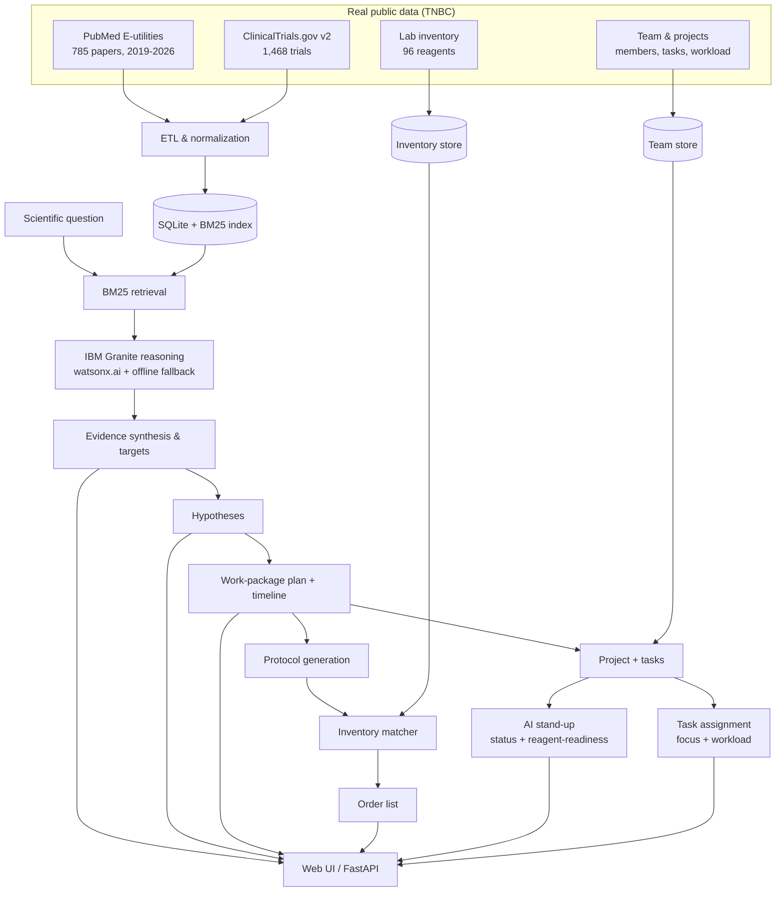

# BenchPilot

**An evidence-grounded AI co-worker for the cancer-biology lab — from a research question to a staffed, scheduled project, in minutes.**

*Built with IBM Bob · IBM AI Builders Challenge — Wildcard Track (Build Intelligent Systems for the Future of Work)*

---

## 🚀 Live demo & video

- **🌐 Live app:** https://lipskerov.github.io/benchpilot/  *(runs fully in the browser — no server, no keys)*
- **🎥 Demo video (≤3 min):** https://youtu.be/EWKyWWj4YKQ
- **📦 Repository:** https://github.com/Lipskerov/benchpilot

---

## ✅ Challenge submission (Wildcard — Future of Work)

| Requirement | Status |
|---|---|
| Working prototype built with **IBM Bob** (primary dev tool) | ✅ Live app + FastAPI backend, developed with Bob (see *How IBM Bob was used*) |
| **AI as a core functional component** | ✅ Retrieval, evidence synthesis, hypothesis generation, experiment planning, and team orchestration are all AI-driven |
| **IBM SkillsBuild** learning activity | ✅ Completed |
| **Public GitHub repo** with README (problem · solution · AI architecture · theme · how Bob was used) | ✅ This document |
| **Public demo/presentation video** (max 3 min) | ✅ 2:36 on YouTube |
| Selected theme | ✅ Wildcard — *Build Intelligent Systems for the Future of Work* |

---

## Problem

Every "AI co-worker" targets the office inbox. **None target the science bench.**

A triple-negative breast cancer (TNBC) research lab drowns in evidence — thousands of PubMed papers and hundreds of clinical trials — yet the highest-value knowledge work stays slow, tacit, and disconnected:

1. **What should we study next** (and hasn't it already been done)?
2. **Design the experiments** to answer it.
3. **Draft the protocols** with precise methods and materials.
4. **Check reagent stock** and order what's missing.
5. **Coordinate the team** — who runs what, in what order, and what's blocked.

Today these steps live in separate tools and people's heads. BenchPilot turns them into one intelligent, outcome-driven system.

## Solution

**BenchPilot** is an AI co-worker for a research lab that closes the full **bench-to-decision** loop and coordinates the team around it:

1. **Ask a scientific question** in plain language → grounded search over **785 PubMed papers + 1,468 clinical trials**.
2. **Discover the real molecular targets** in the evidence, with cited papers and trials (PMIDs, NCT IDs).
3. **Generate competing, testable hypotheses** — plain-language summaries, quantitative predictions, and falsification criteria.
4. **Get a work-package experiment plan with a timeline** (sequential + parallel experiments, test groups, cell lines, reagents).
5. **Draft a protocol** and **reconcile it against live reagent inventory** → flags exactly what to order.
6. **Spin the plan into a staffed project** — auto-assign the team, drag-and-drop board, per-project WP roadmap.
7. **AI stand-up + orchestration** — reads live status, reagent-readiness, and workload to say what to do next and who should do it.

The reasoning layer runs on **IBM Granite (watsonx)** when configured, with a **grounded offline engine** (BM25 retrieval + templated reasoning) so it works with zero keys. Every recommendation is defensible, not guessed.

## AI Approach & Architecture



**Core components**

| Module | Technology | Purpose |
|---|---|---|
| Data ingestion | PubMed E-utilities · ClinicalTrials.gov API v2 | Real TNBC papers + trials |
| Knowledge base | SQLite + **BM25** retrieval | Precise, explainable evidence matching |
| Reasoning | **IBM Granite (watsonx.ai)** + grounded offline fallback | Synthesis, targets, hypotheses, experiment plans, protocols |
| Inventory | SQLite + fuzzy matcher | Reconcile protocol materials vs live stock → order list |
| Team & projects | SQLite + AI digest | Board, WP roadmap, AI stand-up, workload-aware assignment |
| Backend | **FastAPI** | REST API |
| Frontend | Vanilla JS + HTML/CSS | Landing/search + workflow UI |
| Static build | `web-build/build_static.py` | Ships the whole app + data as static files for GitHub Pages (client-side engine) |

**Why it's more than a chatbot:** grounded in a real curated corpus; BM25 (not just embeddings) for precise, explainable retrieval; hypotheses with predictions *and* falsification; quantitative experiment plans with dependencies; and reagent-aware team orchestration — with transparent citations throughout.

## Selected Theme

**Wildcard Track — "Build Intelligent Systems for the Future of Work."**

BenchPilot is an **AI co-worker + project-planning assistant + decision-intelligence + workflow-orchestration** system for scientific research:

- **Reduces repetitive work** — automates literature/trial scanning, experiment planning, protocol drafting, and reagent checks.
- **Improves decision-making** — evidence-grounded hypotheses, gap-aware suggestions, and an AI stand-up that surfaces blockers and priorities.
- **Helps teams achieve outcomes faster** — turns a question into a staffed, scheduled project with a timeline and a live board.

It transforms research from disconnected tasks into an intelligent, outcome-driven system.

## How IBM Bob Was Used

**IBM Bob was the primary development tool for BenchPilot** — used to plan, build, test, and version-control the project through **spec-driven development**.

**Workflow**
1. **Spec first.** Wrote `PROJECT-MAP.md`, `SPEC.md`, and `INVENTORY-SPEC.md` as the source of truth — precise feature specs with acceptance criteria — so Bob had unambiguous requirements.
2. **Ask mode** to explore the codebase and scope each phase.
3. **Plan mode** to generate an implementation plan per phase (ETL → retrieval → reasoning → inventory → team → UI).
4. **Build mode** to implement each feature against the spec, one at a time.
5. **GitHub integration** — Bob's GitHub MCP (`.bob/mcp.json`) was used so **every commit and push was done through Bob**, giving a Bob-authored version history.
6. **Review** with Bob before submission to catch gaps.

**Bob-authored commit trail** (see `git log`):
- `chore: project scaffolding and specs`
- `feat(etl): PubMed + ClinicalTrials.gov TNBC fetchers`
- `feat(db): normalize + build BM25 index`
- `feat(app): grounded TNBC Q&A with citations`
- `feat(inventory): protocols + live-inventory check with order list`
- `feat: BenchPilot V2 — FastAPI app, grounded retrieval, Granite reasoning, protocol drafting, inventory order flagging`
- `feat: BenchPilot V3 — team collaboration (board, AI stand-up, task assignment, reagent-aware orchestration)`
- `feat: BenchPilot V4 — hypotheses + experiment plan/timeline, project editor + drag-drop board, WP roadmap, experiment design + protocol photos`
- `feat: landing/search main page + static GitHub Pages build`

**Credit-conscious approach:** a strong spec up front minimized re-prompts; one Plan-mode call per phase; and manual testing/config between Bob sessions conserved Bobcoins for the high-leverage generative work (ETL, reasoning engine, UI).

## Features

**Bench-to-decision workflow**
- Landing/search main page → grounded evidence synthesis with citations
- Target extraction ranked by real evidence
- Competing hypotheses (plain-language, prediction, falsification, confidence)
- Work-package experiment plan with a **Gantt timeline** (parallel + sequential)
- Protocol drafting reconciled against **live reagent inventory** → order list (CSV)

**Team & orchestration**
- Projects with drag-and-drop **Kanban board** and a per-project **WP roadmap**
- **AI stand-up** (status, reagent-readiness, blockers, priorities)
- Workload-aware **task assignment** + project editor (assign the team, adjust tasks)
- Experimental design on tasks (test groups, cell lines, replicates) + **protocol photos** (Western blot, IF microscopy, plate maps)

**Reagent inventory**
- Searchable catalogue (chemical / biological / plastic) with concentration, purity, MW, stock
- Add/edit/delete items; low-stock and expiry flags

## Quick Start

```bash
git clone https://github.com/Lipskerov/benchpilot.git
cd benchpilot
pip install -r requirements.txt

# Run the app (offline engine — no keys needed)
python -m uvicorn api.main:app --reload
# open http://127.0.0.1:8000
```

**Optional — real IBM Granite (watsonx):** `cp .env.example .env` and fill `WATSONX_API_KEY`, `WATSONX_PROJECT_ID`, `WATSONX_URL`, `GRANITE_MODEL_ID`. The app auto-uses the offline engine if keys are absent.

**Rebuild the data (optional):**
```bash
python etl/fetch_pubmed.py && python etl/fetch_trials.py && python etl/build_db.py
python etl/gen_inventory.py && python etl/gen_team.py && python etl/gen_demo_images.py
```

**Build the static site (for GitHub Pages):**
```bash
python web-build/build_static.py      # → ./site/  (deploy this folder)
```

**Produce the demo video (optional):** Playwright recorder in `demo/.rec/` (`make.sh`), narration in `demo/NARRATION.md`, voice-over via `demo/add-voiceover.sh`. Generated videos are gitignored.

## Project Structure

```
benchpilot/
├── README.md · PROJECT-MAP.md · SPEC.md · INVENTORY-SPEC.md
├── .bob/mcp.json               # Bob GitHub-MCP config (proof of Bob usage)
├── api/main.py                 # FastAPI backend (REST API)
├── web/                        # Frontend (index.html, app.js, styles.css)
│   ├── static-backend.js       # client-side API for the static GitHub Pages build
│   └── uploads/                # protocol images (Western blot, IF, plate map)
├── web-build/build_static.py   # builds ./site/ for GitHub Pages
├── etl/                        # PubMed + ClinicalTrials.gov ETL, inventory/team/image generators
├── src/
│   ├── llm/                    # granite.py (watsonx) · reasoning.py (targets/hypotheses/plan)
│   ├── memory/retrieval.py     # BM25
│   ├── protocols/generate.py   # protocol templates
│   ├── inventory/              # store.py · match.py
│   └── team/                   # store.py · digest.py (AI stand-up + assignment)
├── data/snapshot/*.jsonl       # committed TNBC corpus + inventory + team
└── requirements.txt
```

## Technology Stack

Python 3.11 · FastAPI · Vanilla JS/HTML/CSS · SQLite · **BM25** retrieval · **IBM Granite via watsonx.ai** (offline fallback) · PubMed E-utilities · ClinicalTrials.gov API v2 · **IBM Bob** (spec-driven development) · Playwright + ffmpeg (demo).

## Acknowledgments

Built for the **IBM AI Builders Challenge** (Wildcard Track), developed with **IBM Bob**. Data from **PubMed** (NCBI) and **ClinicalTrials.gov**; reasoning powered by **IBM Granite** via watsonx.ai.

---

**Repository:** https://github.com/Lipskerov/benchpilot · **Contact:** Fedor Lipskerov · License: MIT
